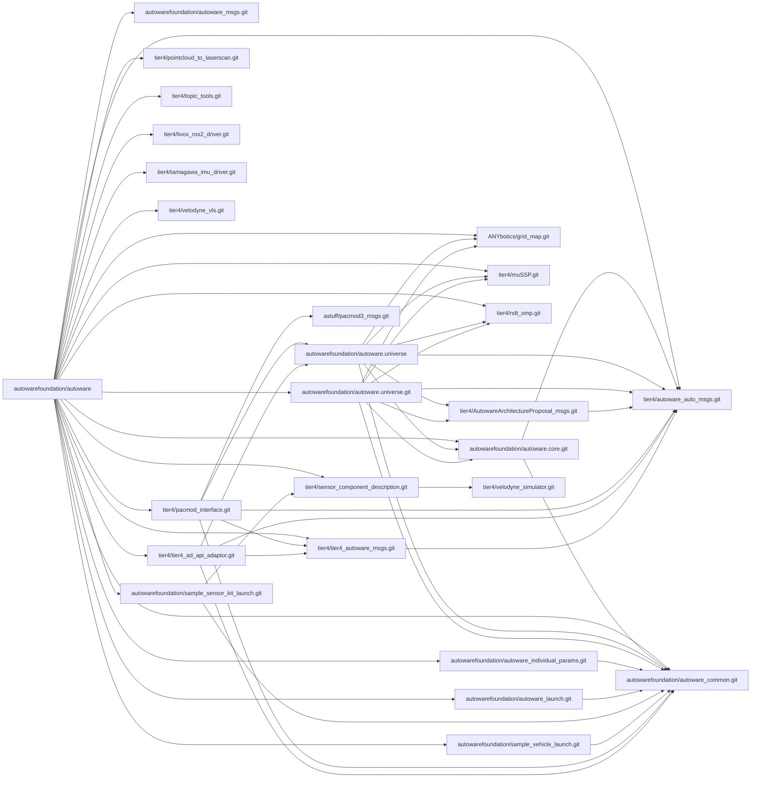

# autoware-depends

```mermaid
graph LR;
    autowarefoundation/autoware-->tier4/autoware_auto_msgs.git;
    autowarefoundation/autoware-->autowarefoundation/autoware_msgs.git;
    autowarefoundation/autoware-->autowarefoundation/autoware_common.git;
    autowarefoundation/autoware-->autowarefoundation/autoware.core.git;
    autowarefoundation/autoware-->autowarefoundation/autoware.universe.git;
    autowarefoundation/autoware-->tier4/tier4_ad_api_adaptor.git;
    autowarefoundation/autoware-->tier4/tier4_autoware_msgs.git;
    autowarefoundation/autoware-->ANYbotics/grid_map.git;
    autowarefoundation/autoware-->tier4/muSSP.git;
    autowarefoundation/autoware-->tier4/ndt_omp.git;
    autowarefoundation/autoware-->tier4/pointcloud_to_laserscan.git;
    autowarefoundation/autoware-->tier4/topic_tools.git;
    autowarefoundation/autoware-->autowarefoundation/autoware_launch.git;
    autowarefoundation/autoware-->tier4/sensor_component_description.git;
    autowarefoundation/autoware-->tier4/livox_ros2_driver.git;
    autowarefoundation/autoware-->tier4/tamagawa_imu_driver.git;
    autowarefoundation/autoware-->tier4/velodyne_vls.git;
    autowarefoundation/autoware-->autowarefoundation/sample_sensor_kit_launch.git;
    autowarefoundation/autoware-->autowarefoundation/sample_vehicle_launch.git;
    autowarefoundation/autoware-->tier4/pacmod_interface.git;
    autowarefoundation/autoware-->autowarefoundation/autoware_individual_params.git;
    autowarefoundation/autoware.core.git-->tier4/autoware_auto_msgs.git;
    autowarefoundation/autoware.core.git-->autowarefoundation/autoware_common.git;
    autowarefoundation/autoware.universe-->tier4/autoware_auto_msgs.git;
    autowarefoundation/autoware.universe-->autowarefoundation/autoware_common.git;
    autowarefoundation/autoware.universe-->autowarefoundation/autoware.core.git;
    autowarefoundation/autoware.universe-->tier4/AutowareArchitectureProposal_msgs.git;
    autowarefoundation/autoware.universe-->ANYbotics/grid_map.git;
    autowarefoundation/autoware.universe-->tier4/muSSP.git;
    autowarefoundation/autoware.universe-->tier4/ndt_omp.git;
    autowarefoundation/autoware.universe.git-->tier4/autoware_auto_msgs.git;
    autowarefoundation/autoware.universe.git-->autowarefoundation/autoware_common.git;
    autowarefoundation/autoware.universe.git-->autowarefoundation/autoware.core.git;
    autowarefoundation/autoware.universe.git-->tier4/AutowareArchitectureProposal_msgs.git;
    autowarefoundation/autoware.universe.git-->ANYbotics/grid_map.git;
    autowarefoundation/autoware.universe.git-->tier4/muSSP.git;
    autowarefoundation/autoware.universe.git-->tier4/ndt_omp.git;
    autowarefoundation/autoware_individual_params.git-->autowarefoundation/autoware_common.git;
    autowarefoundation/autoware_launch.git-->autowarefoundation/autoware_common.git;
    autowarefoundation/sample_sensor_kit_launch.git-->autowarefoundation/autoware_common.git;
    autowarefoundation/sample_sensor_kit_launch.git-->tier4/sensor_component_description.git;
    autowarefoundation/sample_vehicle_launch.git-->autowarefoundation/autoware_common.git;
    tier4/AutowareArchitectureProposal_msgs.git-->tier4/autoware_auto_msgs.git;
    tier4/pacmod_interface.git-->tier4/autoware_auto_msgs.git;
    tier4/pacmod_interface.git-->autowarefoundation/autoware_common.git;
    tier4/pacmod_interface.git-->autowarefoundation/autoware.universe;
    tier4/pacmod_interface.git-->astuff/pacmod3_msgs.git;
    tier4/pacmod_interface.git-->tier4/tier4_autoware_msgs.git;
    tier4/sensor_component_description.git-->tier4/velodyne_simulator.git;
    tier4/tier4_ad_api_adaptor.git-->tier4/autoware_auto_msgs.git;
    tier4/tier4_ad_api_adaptor.git-->autowarefoundation/autoware_common.git;
    tier4/tier4_ad_api_adaptor.git-->tier4/tier4_autoware_msgs.git;
    tier4/tier4_ad_api_adaptor.git-->autowarefoundation/autoware.universe;
    tier4/tier4_autoware_msgs.git-->tier4/autoware_auto_msgs.git;
```